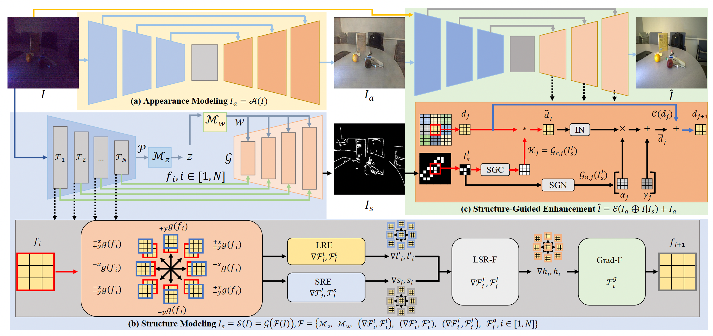

# Low-Light Image Enhancement via Structure Modeling and Guidance

This is a pytorch project for the paper **Low-Light Image Enhancement via Structure Modeling and Guidance** by Xiaogang Xu, Ruixing Wang, and Jiangbo Lu presented at **CVPR2023**.


## Introduction
This paper proposes a new framework for low-light image enhancement by simultaneously conducting the appearance as well as structure modeling. 
It employs the structural feature to guide the appearance enhancement, leading to sharp and realistic results. The structure modeling in our framework is implemented as the edge detection in low-light images. 
It is achieved with a modified generative model via designing a structure-aware feature extractor and generator.
The detected edge maps can accurately emphasize the essential structural information, and the edge prediction is robust towards the noises in dark areas. 
Moreover, to improve the appearance modeling, which is completed with a simple U-Net, a novel structure-guided enhancement module is proposed with structure-guided feature synthesis layers.



[paper link](https://arxiv.org/abs/2305.05839)

## Dataset

###LOL datasets

Please download the LOL-v2 from [CVPR-2020-Semi-Low-Light](https://github.com/flyywh/CVPR-2020-Semi-Low-Light).
The directory of LOL-real should contain Real_captured/Train and Real_captured/Test.
The directory of LOL-synthetic should contain Synthetic/Train and Synthetic/Test.
Please modify the data path of LOL-real and LOL-synthetic in datasets/LOL_real.py and datasets/LOL_synthetic.py, respectively.

###SID dataset

For SID, we use the subset captured by the Sony camera and follow the script provided by SID to transfer the low-light images from RAW to RGB using rawpy’s default ISP.
You can download our processed datasets for SID from [baidu pan](https://pan.baidu.com/s/1Qol_4GsIjGDR8UT9IRZbBQ) (验证码: btux), and there should contain long_sid2 and short_sid2".
The SID dataset can also be downloaded from [google pan](https://drive.google.com/drive/folders/1eQ-5Z303sbASEvsgCBSDbhijzLTWQJtR?usp=share_link).
Please modify the data path of SID in datasets/SID.py

## Project Setup

First install Python 3. We advise you to install Python 3 and PyTorch with Anaconda:

```
conda create --name smg python=3.8
source activate smg
```

Clone the repo and install the complementary requirements:
```
cd $HOME
git clone --recursive git@github.com:xiaogang00/SMG-LLIE.git
cd SMG-LLIE
pip install -r requirements.txt
```

Our code is tested on RTX3090 with CUDA11.

## Usage

### Train
Train the model on the corresponding dataset using the train config.

For example, the training on SID:
```
sh train_SID.sh
```

If you want to resume the training, you should add "--keep_optimizer" and "--resume_training_from_ckpt" in the script.

### Test

We use PSNR and SSIM as the metrics for evaluation. Evaluate the model on the corresponding dataset using the test config.

For the evaluation on SID, use the following command line:
```
sh test_SID.sh
```

For the evaluation on LOL_real, use the following command line:
```
sh test_LOL_real.sh
```

For the evaluation on LOL_synthetic, use the following command line:
```
sh test_LOL_synthetic.sh
```

### Pre-trained Model

You can download our trained model using the following links: https://drive.google.com/file/d/1pevOfv5VTptfHYiswGEvWE3B-e-vxHPw/view?usp=share_link

## Citation Information

If you find the project useful, please cite:

```
@inproceedings{xu2023dp3df,
  title={Low-Light Image Enhancement via Structure Modeling and Guidance},
  author={Xiaogang Xu, Ruixing Wang, and Jiangbo Lu},
  booktitle={CVPR},
  year={2023}
}
```


## Acknowledgments
This source code is inspired by [e4e](https://github.com/omertov/encoder4editing), [gpen](https://github.com/yangxy/GPEN), [cyclegan](https://github.com/junyanz/pytorch-CycleGAN-and-pix2pix), [Uformer](https://github.com/ZhendongWang6/Uformer)

## Contributions
If you have any questions/comments/bug reports, feel free to e-mail the author Xiaogang Xu ([xiaogangxu00@gmail.com](xiaogangxu00@gmail.com)).
